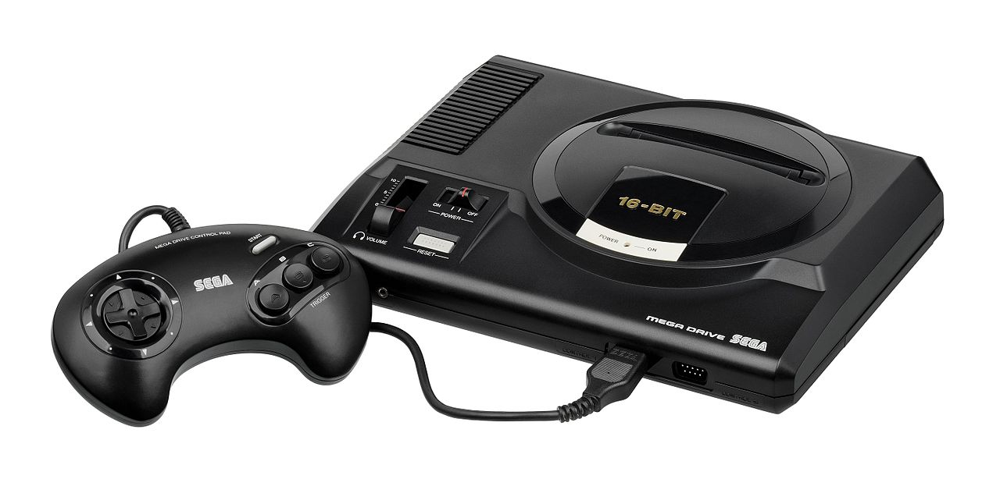

# 2. Historia de la Mega Drive

La Sega Mega Drive, fue la tercera consola de videojuegos publicada por la misma tras la SG-1000 y la Master System, Sega impulsó el uso de un procesador de 16 bits; por lo que publicó podemos decir el primer sistema de entretenimiento de 16 bits en el mercado. Tratando de superar el éxito de la NES [^4] de Nintendo.

Sega Trató de superar con los modelos Mark 2 y Mark 3 de la Sega Master System con los 8 bits, pero no tuvo gran aceptación en Japon; no siendo el mismo caso en Europa.

El 29 de Octubre de 1988, Sega Lanzo la Sega Mega Drive que es conocida durante su desarrollo como "Mark V" a través de la revista _beep!_. Sin embargo, no tuvo mucho éxito al principio y solo se vendierón unas 400.000 unidades.

Más adelante, Sega America trató de hablar con Atari para que distribuyera Mega Drive en America; sin embargo lo rechazaron (se centrarón en lanzar Atari ST). Fue entonces, cuando Sega distribuyo bajo su propia subsidiaria Sega of Ameria, la Sega Mega Drive con el nombre de Sega Genesis. La Sega Genesis, fue lanzada el 9 de enero de 1989.

En Europa, La Sega Mega Drive se lanzó el 30 de Noviembre de 1990; aprovechando el éxito tenido con la Sega Master System y que ya había publicados más juegos como _Altered Beast_, _Golden Axe_,etc...

Fue en el año 1992, cuando Sega lanzó grandes éxitos de su catálogo; como Sonic 2 y se puso a la venta el primer modelo de Sega CD. Sin embargo, no tuvo mucho éxito por carecer de poco catálogo y un elevado precio.

En 1993, Sega presento la Mega Drive 2 con un rediseño de la misma. Sin embargo, ese año Nintendo superó a Sega en plena guerra de los 16 bits.

En el año 1994, aparecierón varios sistemas (3DO, Jaguar,etc...) Sega Japon estaba con el proyecto "Saturn" mientras Sega America trató de comercializar el periférico 32X. Al final de ese año con la aparición del juego _Donkey Kong country_ para la SNES[^5], hicieron que la Sega Mega Drive fuera decayendo. No sin antes dar grandes títulos de dicha consola como el _Ristar_ o _Rocket Knigth Adventures_ [^6].

[^4]: NES (Nintendo Entertainment System): es una marca registrada de Nintendo Company Ltd.

[^5]: SNES (Super Nintendo Entertainment System): es una marca registrada de Nintendo Company Ltd.

[^6]: Rocket Knigth Adventures es un videojuego para Sega Mega Drive Desarrollado por Konami. Todos los derechos reservados.

## Especificaciones de la Mega Drive

Veamos las especificaciones de la Sega Mega Drive:

1. CPU1: Procesador Motorola 68000 de 16bits a 7,61Mhz (PAL) o 7,67Mhz (NTSC).
2. CPU2: Procesador Zilog Z80 de 8 bits.
3. Memoria: 64Kb de memoria y 64Kb de memoria de vídeo más 8Kb de memoria de sonido.
4. Vídeo: Procesador VDP con resolución de 320x224 (320x240 en NTSC); con capacidad de hasta 61 colores por pantalla. Aunque tenia capacidad de mostrar hasta 512 colores diferentes.
5. Sonido: 6 Canales FM gracias al chip de sonido el Yamaha YM2612 y un chip adicional de sonido de 4 canales de 8 bits SN76489.
6. Entrada/salida: Slot de cartuchos por la parte superior, dos conectores para controladores, bus de expansión y entrada de auriculares estereo(solo modelo 1).

## Periféricos

Veamos también, algunos de los periféricos más conocidos de la Sega Mega Drive.

### Power Base Converter

### Sega Mouse

### Mega CD

### 32X

### Mega Modem

### Sega Activator

## Juegos y Sagas conocidos

### Sonic

### Streets Of Rage

### Golden Axe

### World of Illusion
